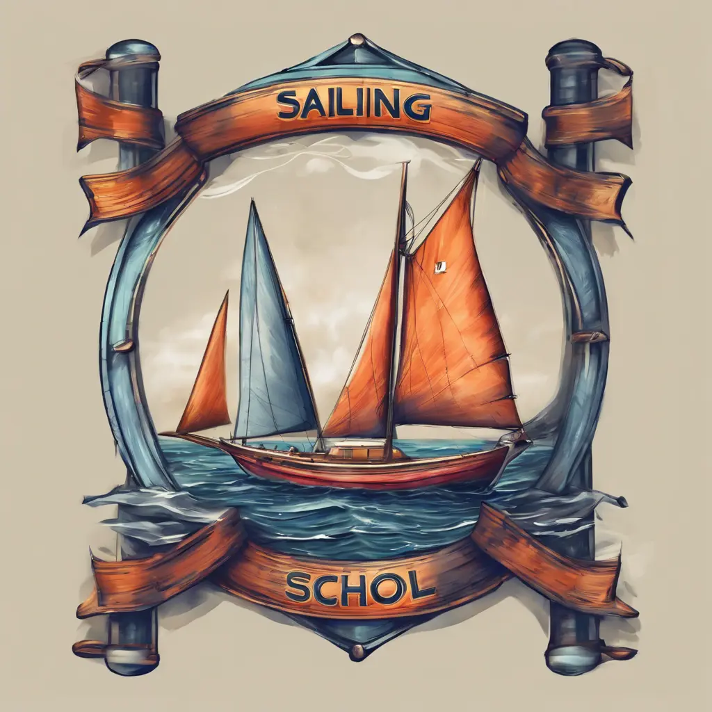
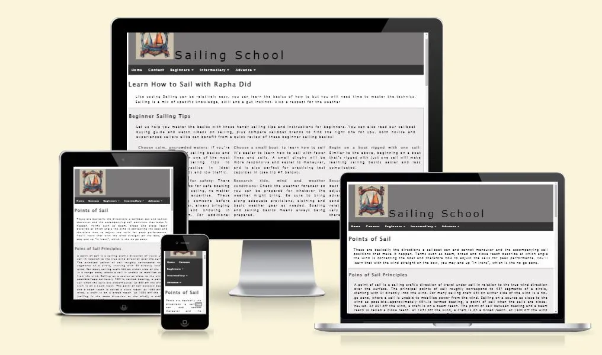
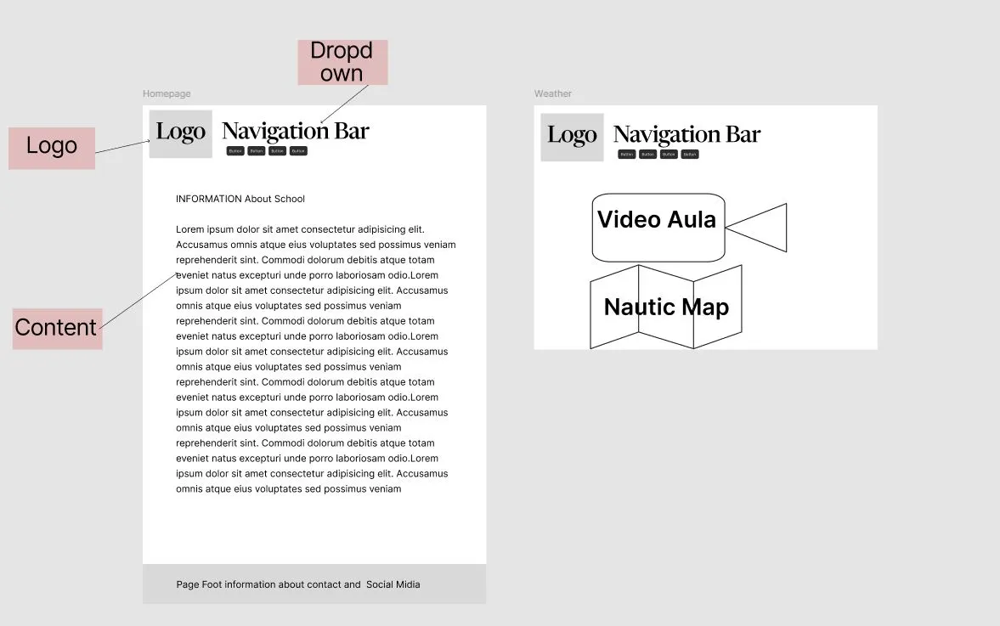
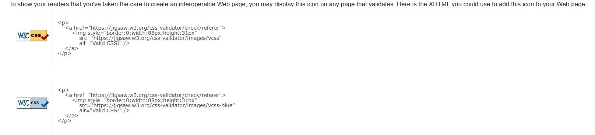
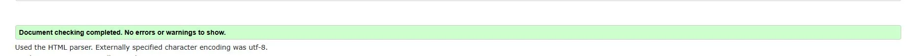

<div align="center">
  
</div>
<div align="center">
  
</div>

[Sailing School]( https://rdidjurgeit.github.io/project1_rdidjurgeit/) Ahoy there! If you've ever dreamt of navigating the open seas, feeling the wind in your sails, and harnessing the power of the ocean, you're in the right place. Sailing School is your go-to resource for mastering the basics of sailing. My idea is to bring information to people that are interested in sailing.

**Table of Contents**

- [UX](#ux)
  - [WireFrame](#wireframe)
  - [Visitor Goals](#visitor-goals)
  - [User goals](#user-goals)
  - [Features](#features)
  - [Visual Design](#visual-design)
    - [Fonts](#fonts)
    - [Icons](#icons)
    - [Colors](#colors)
    - [Images](#images)
  - [Features](#features-1)
  - [Page Elements](#page-elements)
  - [Navbar](#navbar)
    - [Index Page](#index-page)
      - [Contact](#contact)
      - [Point of Sail](#point-of-sail)
    - [Weather Forecast](#weather-forecast)
  - [Future Ideas](#future-ideas)
    - [Classes](#classes)
    - [Content](#content)
- [Technologies Used](#technologies-used)
  - [Languages](#languages)
  - [Libraries](#libraries)
  - [APIs](#apis)
  - [Platforms](#platforms)
  - [Other Tools](#other-tools)
- [Testing](#testing)
  - [Methods](#methods)
    - [Validation](#validation)
    - [General Testing](#general-testing)
    - [Mobile Testing](#mobile-testing)
    - [Desktop Testing](#desktop-testing)
    - [SEO](#seo)
  - [Bugs](#bugs)
- [Deployment](#deployment)
  - [Local Deployment](#local-deployment)
    - [Local Preparation](#local-preparation)
  - [Credits and Contact](#credits-and-contact)
    - [Content](#content-1)
    - [Contact](#contact-1)

----

# UX

- This project is designed for sailing enthusiasts who want to learn and explore key concepts such as navigation, weather forecasting, and safety rules. Beginners and intermediates will find the content accessible and engaging.

## WireFrame



## Visitor Goals

- People who want to learn how to Sail.
- People who are interested in advancing your knowledge.
- People who want to buy a Boat.
- People who want to know about safety.

## User goals

- Navigate through the website on different topics.
- Checking a Repository with Nautical Terms.
- Contact to know more about.
- Get an overview of Basic Sailing.
- Check for weather

## Features

- **Responsive Design**: Works seamlessly across desktops, tablets, and mobile devices.
- **Interactive Forms**: Simple and accessible contact forms for feedback.
- **Navigation**: Clear and intuitive menu structure for quick access to key resources.
- Option To check weather and tide.
- Give Basic of Sail Point.

## Visual Design

- I decide to go with a simple design since the content is the important part
  
### Fonts

- The primary font, [Lucida Sans Unicode](https://online-fonts.com/fonts/lucida-sans-unicode) was chosen because IT is a font friendly for dyslexia, making it easily readable throughout the pages. It uses true Bootstrap as an external link

### Icons

- Icons are taken from the [Fontawesome](https://fontawesome.com/) Icon library and are utilised as classes in the `<i>` tag.
- As they are utilized as classes, they can easily be styled using other classes or IDs in the same tag. I often used Bootstrap classes to style them uniformly.

### Colors

- I wanted the site to maintain a minimal aesthetic, colors are very basic and clean.

### Images

- The site has some images for better visualization like in POint of Sail.

----

## Features

- The page is a simple tutorial to lear how to sail with some information about safety and weather forecast

## Page Elements

- Pages consisted of a lot of text some videos and a menu for better navigation.

## Navbar


- The Navbar is simple, providing a Home, Contact, and 2 Botton divided by level of Knowledge.
- The Logo was made by [Dreamstudio](https://dreamstudio.ai/) .
- The navbar is not fixed but there is a **Top Button**.

### Index Page

- Delivery information from Basic Sailing.
- Uses the javascript for going to the Top from [W3School](https://www.w3schools.com/).

#### Contact

- Simple Formula required to fill and to be sent.
- Send Option to go to a Joke webpage since the API is not jet-installed

#### Point of Sail

- Is the 3 page that can be accessed at the moment.
-Is considered Intermediary content.

### Weather Forecast

- Is the 4 page that can be accessed at the moment.
- Vou has a YouTube video explaining a bit about sail trims an important part of weather conditions made available by Windywidge.
-Is considered Intermediary content here you have the option to check the weather at the moment is set to Bremen made available by Windywidge.
- You can check the Tide and Wind Direction with a small explanation.
- the script is pre-made developed and available from the Windywidge website

## Future Ideas

- In time this page will belong to a big project uniting, where you will be able to have a logging and even take classes for you boat license
  
### Classes

- A selection of classes that I consider interesting to be recorded to change the outside content.

### Content

- Considering making an Instagram and having a better Foot in the social media

----

# Technologies Used

- This Website uses static HTML and CSS and only scrips for the Weather and YouTube since there are no other ways unless you add a link to redirect to Youtube, but the idea was to give a preview of how it can be,
-

## Languages

- [HTML](w3.org/standards/webdesign/htmlcss) Page markup.
- [CSS](w3.org/standards/webdesign/htmlcss) Styling.
- [Javascript](https://www.w3.org/wiki/Javascript) Running small functions for interactive like a weather forecast.

## Libraries

- [Bootstrapcdn](https://maxcdn.bootstrapcdn.com/) Font Styles.
- [Fontawesome](https://fontawesome.com/) Used for icons

## APIs

- [Windy App](https://windy.app/) Weather Forecast and Tides.
- [Youtube Channel  NS14video](https://www.youtube.com/@NS14video) Video use NS14 Racing Tip 09 Sail Trim

## Platforms

- [Github](https://github.com/) Storing code remotely and deployment.
- [Gitpod](https://gitpod.io/) IDE for project development.

## Other Tools

- [Visual Studio Code](https://code.visualstudio.com/) To create.
- [Favicon from icons8](https://icons8.com/) Favicons
- **Extension:** Code Spell Checker;Prettier; Live Server

----

# Testing

- Since the project is a static HTML and CSS the best way to test is to go to W3C and manually input your source code for each page and check if present any error.
- For each page, you should should look like this





- For more information look at the Methods to have all the links for it

## Methods

-First, go to the git repository be sure that all your code is updated, and push to the repository. Go to:

```
Deployments (right from your page after Packages and before Languages.)
```

- The Git hub will have on the top of all the deployments the link for your page. Click and the page that will show up. With this page, you can inspect and check the source code and add it to the W3C webpage [W3C HTML5 Validator](https://validator.w3.org/). Navigate true your page and to these steps for each page.
- On the inspect mode you can check also the LightHouse from Google for SEO and also the responsiveness for different screams.

### Validation

- HTML has been validated with [W3C HTML5 Validator](https://validator.w3.org/).
- CSS has been validated with [W3C CSS Validator](https://jigsaw.w3.org/css-validator/)
- Links checked with [W3C Link Checker](https://validator.w3.org/checklink).
- Each javascript file was tested on the site for errors and functionality using the console and with [JSHint](https://jshint.com/).

### General Testing

- The original website was first developed for WEB and not other devices. So it was Committed as full and other implementations were made.
-It was deleted and created a copy with some styles from the previous but built up from Mobile to Desktop.
- All forms have validation.

### Mobile Testing

- I tested the site personally on my mobile, going through all the pages.
- Chrome was utilized to inspect the site in mobile format, going through the pages and functions.

### Desktop Testing

- The site was marginally tested on other browsers, such as Firefox.

### SEO

- Using LightHouse from Google you can check the SEO giving a Performance of 97% true on the pages except the Weather page where it reaches 71% since has an outdated API.

## Bugs

- No Bugs were found.

----

# Deployment

- Use the choice Deployment in my case it was used the GitHub.
-

## Local Deployment

- For Local Deployment you will need to go to the GitHub  [Repository](https://github.com/rdidjurgeit/project1_rdidjurgeit), find the Local tap, and close using the web URL. After you clone for your pc directory use something like LiveServer to see the code in action.

### Local Preparation

- In case you want to do a similar project use an IDE if your choice and download the extensions and requirements you will need, configure your workspace. I use a bigger space in between Later and Prettier to have a better visual for the indentations. Live server is also required to check your work and for the README the Markdown preview.

**Requirements:**

- An IDE of your choice, such as [Visual Studio Code](https://code.visualstudio.com/)
- [Git](https://git-scm.com/)
- You will have to set up a connection with an email

## Credits and Contact

-Credits and Contacts are important parts of the project most of the code was created for me with some ideas using the official W3school. The map and Youtube have the respective creators

### Content

Some Texts where taken from [Discovering Boating](https://www.discoverboating.com/) and [wikipedia](https://www.wikipedia.org/).
but was also based on my own knowledge
Any code utilized from a site is documented and credited in this read me.
Video is offered By YouTube and has a Logo as a weather forecast tool also have the logo.
Readme example provide by my mentor Patrick Rory.

### Contact

- Please feel free to contact me at `didjurgeit.raphael@gmail.com`
