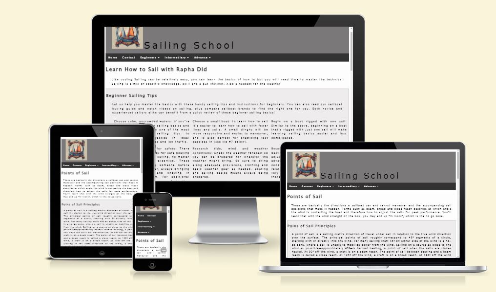
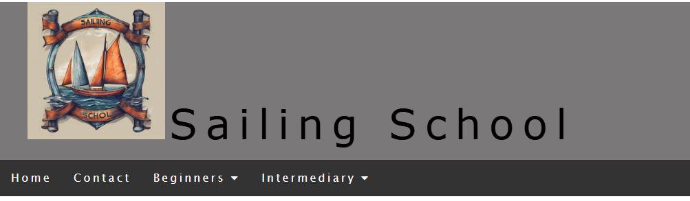

  

  

[Sailing School]( https://rdidjurgeit.github.io/project1_rdidjurgeit/) Ahoy there! If you've ever dreamt of navigating the open seas, feeling the wind in your sails, and harnessing the power of the ocean, you're in the right place. Sailing School is your go-to resource for mastering the basics of sailing. My Ideia is to bring information to people that are interest in sailing.
## Table of Contents
1. 

    
<a href="#ux">UX</a>

    <ul>
    <li>

    
<a href="#goals">Goals</a>

    - [Visitor Goals](#visitor-goals)
    - [Business Goals](#business-goals)
    - [User Stories](#user-stories)
    
</li>

    <li>

    
<a href="#visual-design">Visual Design</a>

    - [Fonts](#fonts)
    - [Icons](#icons)
    - [Colors](#colors)
    - [Images](#images)
    
</li>
    </ul>

2. 

    
<a href="#features">Features</a>

3. 

    
<a href="#technologies-used">Technologies Used</a>

    - [Languages](#languages)
    - [Libraries](#libraries)
    - [APIs](#apis)
    - [Platforms](#platforms)
    - [Other Tools](#other-tools)

4. 

    
<a href="#testing">Testing</a>

    <ul>
    <li>

    
<a href="#methods">Methods</a>

    - [Validation](#validation)
    - [General Testing](#general-testing)
    - [Mobile Testing](#mobile-testing)
    - [Desktop Testing](#desktop-testing)
    
</li>

    <li>

    
<a href="#bugs">Bugs</a>

    - [Known Bugs](#known-bugs)
    - [Fixed Bugs](#fixed-bugs)
    
</li>
    </ul>

5. 

    
<a href="#deployment">Deployment</a>

    <ul>
    <li>

    
<a href="#local-deployment">Local Deployment</a>

    - [Local Preparation](#local-preparation)
    - [Local Instructions](#local-instructions)
    
</li>

    <li>

    
<a href="#github-deployment">Github Deployment</a>

    - [Github Preparation](#github-preparation)
    - [Github Instructions](#github-instructions)
    
</li>
    </ul>

6. 

    
<a href="#credit-and-contact">Credit and Contact</a>

    - [Content](#content)
    - [Contact](#contact)

----

# UX
## Goals
### Visitor Goals
The target audience :
- People who want to Lear how to Sail.
- People who are interested in advance your one knowledge .
- People that want to buy a Boat.
- People that want to know about safety .

User goals are:
- Navigate true the website in different topics.
- Checking a Repository with Nautical Terms.
- Contact to know more about.
- Get an overview of Basic of Sailing.

The School fills these needs by:
- Opening with a basic overview in the main page.
- Option To check weather and tide.
- Give Basic of Sail Point.

## Visual Design
### Fonts
- The primary font, [Lucida Sans Unicode](https://online-fonts.com/fonts/lucida-sans-unicode) was chosen because IT is a font friendly for dyslexia , making it very easily readable throughout the pages. IT is use true the Bootstrap as a external link

### Icons
- Icons are taken from the [Fontawesome](https://fontawesome.com/) Icon library and are utilised as classes in the `<i>` tag.
- As they are utilized as classes, they can easily be styled using other classes or IDs in the same tag. I often used Bootstrap classes to style them uniformly.

### Colors
- I wanted the site to maintain a minimal aesthetic, colors are very basic and clean .

### Images
- The site has some images for better visualization like in POint of Sail.

----

# Features
## Page Elements
### All Pages
#### Navbar

  

- The Navbar is simple, providing a Home, Contact and 3 Botton deviding by level of Knowledge .
- The Logo was made by [Dreamstudio](https://dreamstudio.ai/) .
- The navbar is not fix but there is a to Top Button.

### Index Page
- Delivery information from Basic Sailing.
- Uses the javascript for go to the Top from [W3School](https://www.w3schools.com/).

#### Contact
- Simple Formular with required to filling and to be send.
- Send Option go to a Joke webpage since the fiture is not jet installed

#### Point of Sail
- Is the 3 page that can be access att the moment .
-Is consider Intermediary content .

### Weather Forecast
- Is the 4 page that can be access att the moment .
- Vou have a You Tube video explaning a bit about sail trim a important part for weather condition made available by Windywidge .
-Is consider Intermediary content here you have the option to check the weather at the moment is set to Bremen made available by Windywidge .
- You can check the Tide and Wind Direction with a small explanation.
- the script is pre-made develop and available from the Windywidge website 

#### C-soon
- Is a default Page for future contenct.

## Feature Ideas
### Classes
- A selection of classes that I consider interesting to be recording to change the outside contenct .

### Content 
- Considering to make a instagram and have a better Foot in the social Midia

----

# Technologies Used
## Languages
- [HTML](w3.org/standards/webdesign/htmlcss)
    * Page markup.
- [CSS](w3.org/standards/webdesign/htmlcss)
    * Styling.
-
- Javascript.
    * Running  small functions for interactive like weather forecast.

## Libraries
- [Bootstrapcdn](https://maxcdn.bootstrapcdn.com/)
    * Font Styles.
- [Fontawesome](https://fontawesome.com/)
    * Used for icons

## APIs
- [Windy App](https://windy.app/)
    * Weather Forecast and Tides.
- [Youtube Channel  NS14video](https://www.youtube.com/@NS14video)
    * Video use NS14 Racing Tip 09 Sail Trim

## Platforms
- [Github](https://github.com/)
    * Storing code remotely and deployment.
- [Gitpod](https://gitpod.io/)
    * IDE for project development.

## Other Tools
- [Visual Studio Code](https://code.visualstudio.com/)
    * To create.
    * Extension: Code Spell Checker;Prettier; Live Server
- [Favicon from icons8](https://icons8.com/)
    * Favicons
----

# Testing
## Methods
### Validation
- HTML has been validated with [W3C HTML5 Validator](https://validator.w3.org/).
- CSS has been validated with [W3C CSS Validator](https://jigsaw.w3.org/css-validator/) 
- Links checked with [W3C Link Checker](https://validator.w3.org/checklink).
- Each javascript file was tested on the site for errors and functionality using the console and with [JSHint](https://jshint.com/).

### General Testing
- The original website was firt develop for WEb and not other devices. So it was Comited as full and other implementation where made
-It was deleted and created copy some styles from previous but build up from Mobile to Desktop.
- All forms have validation .

### Mobile Testing
- I tested the site personally in my mobile, going through all the pages.
- Chrome was utilised to inspect the site in mobile format, going through the pages and functions.

### Desktop Testing
- The site was marginally tested on other browsers, such as Firefox.

## Bugs
### Known Bugs
- Occasionally  when in the GIthup if you are in the Contact page and want to jump in the menu from one of the beguiner section is go 404 error.
----

# Deployment
## Local Deployment
### Local Preparation
**Requirements:**
- An IDE of your choice, such as [Visual Studio Code](https://code.visualstudio.com/)
- [Git](https://git-scm.com/)
- You will have to set up a connection with an email

## Credits and Contact
### Content
Some Text where taken from [Discovering Boating](https://www.discoverboating.com/) and [wikipedia](https://www.wikipedia.org/).
but was also base in my one knowledge 
Any code utilised from a site is documented and credited in the  this read me.
Video is offer By YOutube and have a Logo as weather forecast tool also have the logo.
Readme exemple provide by my mentor Patrick Rory.

### Contact
Please feel free to contact me at `didjurgeit.raphael@gmail.com`